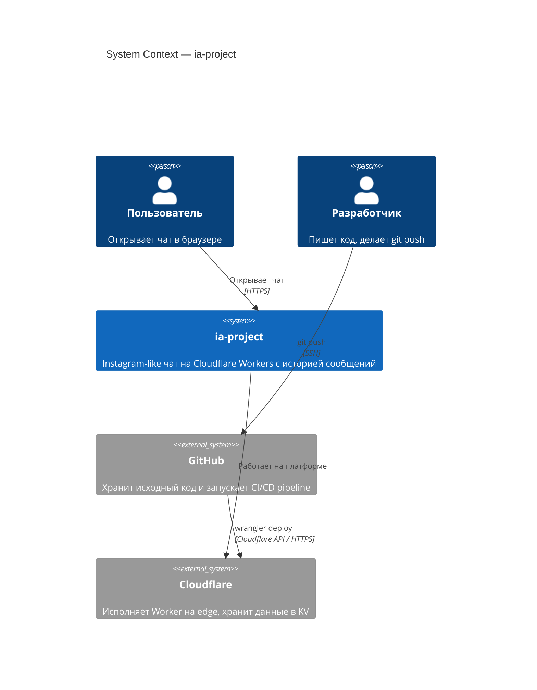
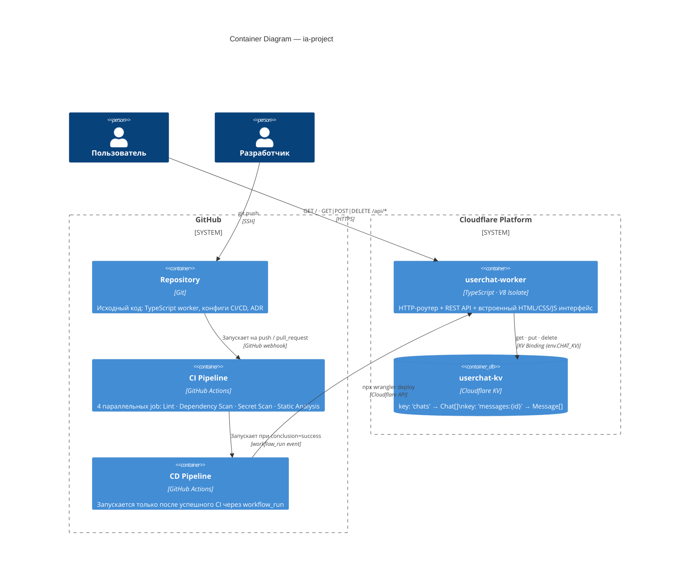
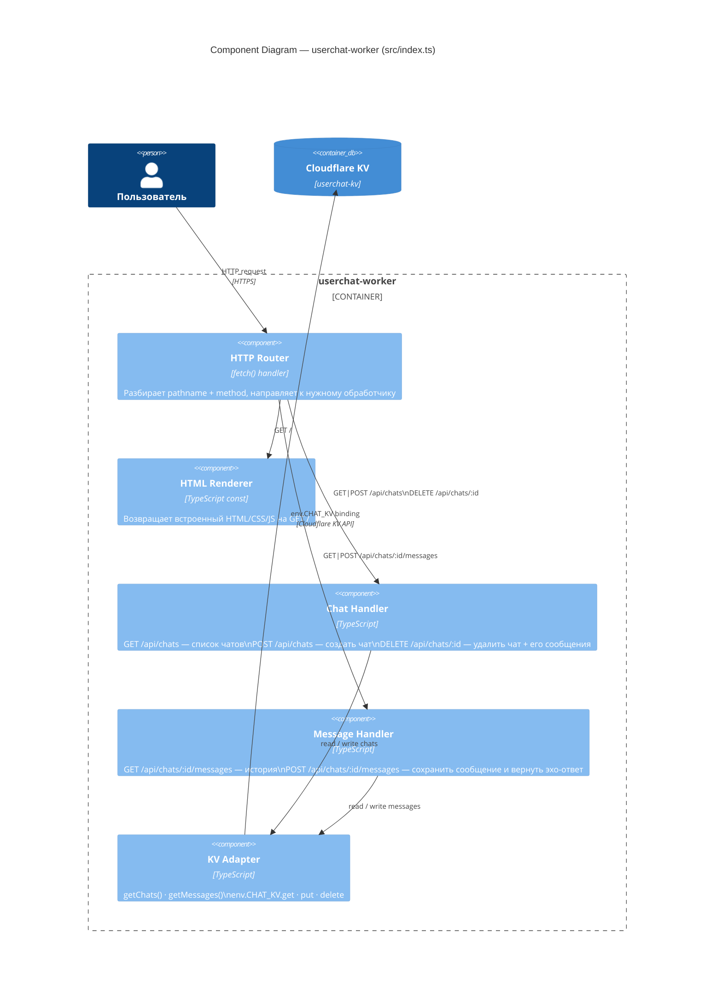
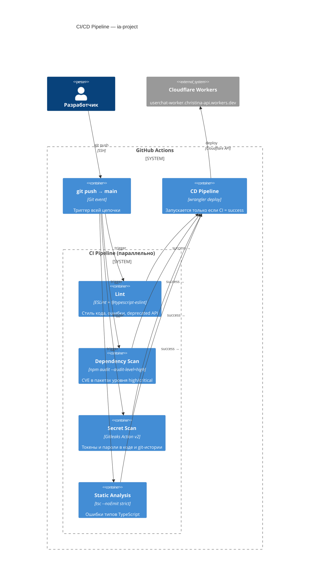

# C4 Model — ia-project

> Три уровня архитектурных диаграмм: Context → Container → Component

---

## Level 1 — System Context

Показывает систему целиком и её связи с пользователями и внешними системами.



---

## Level 2 — Container

Показывает из каких контейнеров состоит система и как они взаимодействуют.



---

## Level 3 — Component

Показывает внутреннюю структуру `userchat-worker`.



---

## Level 2 (дополнение) — CI/CD Pipeline

Детализация процесса доставки кода в продакшн.



---

## Ключевые структуры данных в KV

```
KV namespace: userchat-kv
│
├── "chats"
│     └── Chat[]
│           ├── id: string (UUID)
│           ├── name: string
│           └── createdAt: number (timestamp)
│
└── "messages:{chatId}"
      └── Message[]
            ├── id: string (UUID)
            ├── role: "user" | "assistant"
            ├── content: string
            └── timestamp: number
```

---

## Маршруты API

| Метод | Путь | Действие |
|---|---|---|
| `GET` | `/` | Отдать HTML интерфейс |
| `GET` | `/api/chats` | Список всех чатов |
| `POST` | `/api/chats` | Создать новый чат |
| `DELETE` | `/api/chats/:id` | Удалить чат и его сообщения |
| `GET` | `/api/chats/:id/messages` | История сообщений чата |
| `POST` | `/api/chats/:id/messages` | Отправить сообщение (эхо-ответ) |
